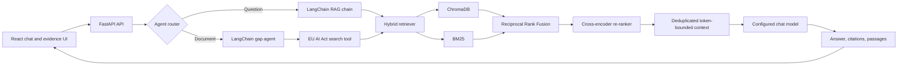

<p align="center">
  
</p>

<h1 align="center">ActLens</h1>

<p align="center">
  A production-oriented, citation-grounded RAG assistant for the EU AI Act.
</p>

<p align="center">
  
  
  
  
  
</p>

ActLens answers questions about Regulation (EU) 2024/1689 and checks internal
policy documents against retrieved provisions. It combines semantic and keyword
retrieval, cross-encoder re-ranking, LangChain agents, verifiable citations, and
an evidence inspector in a focused React interface.

> [!IMPORTANT]
> ActLens is a compliance-support and research project, not legal advice.
> Generated answers must be reviewed against the cited regulation text.

## Why this project is different

Many RAG demos stop at “embed documents and call an LLM.” ActLens includes the
engineering needed to inspect and improve retrieval:

- **Hybrid retrieval:** ChromaDB vectors and BM25 keyword search
- **Rank fusion:** Reciprocal Rank Fusion combines both candidate lists
- **Legal-aware retrieval:** article-number detection and metadata boosting
- **Re-ranking:** a cross-encoder scores query-passage relevance
- **Grounded generation:** prompts require context-only answers and inline citations
- **Evidence visibility:** users can inspect citations and retrieved passages
- **Offline evaluation:** versioned retrieval cases report Hit@K, MRR, and nDCG
- **Incremental indexing:** content hashes prevent unnecessary re-embedding
- **Operational controls:** readiness checks, request IDs, latency headers,
  upload limits, sanitized errors, and an opt-in administrative ingest endpoint
- **Reproducibility:** CI, containers, tests, typed configuration, and documented setup

## Measured retrieval baseline

The checked-in English smoke benchmark currently reports:

- **Hit@5:** 94.1% (32/34 cases)
- **MRR:** 0.783
- **nDCG@5:** 0.823
- **Coverage:** 34 natural and scenario questions across 32 articles
- **Query slices:** 92.0% Hit@5 for natural questions; 100% for scenarios

The full report is in [`evals/latest-results.json`](evals/latest-results.json).
Reproduce it with:

```bash
python scripts/evaluate_retrieval.py --top-k 5 \
  --output evals/latest-results.json
```

The two current misses are high-risk classification without an explicit article
number and a broad provider-obligations query. Keeping these failures visible
makes the benchmark useful for improving retrieval. This is still a
developer-authored regression suite, not proof of legal correctness; independent
expert review and multilingual cases remain roadmap items.

## Product workflows

### Ask about the EU AI Act

Ask a legal or compliance question, receive a grounded answer, and inspect the
specific articles, recitals, annexes, source links, and retrieved text used to
produce it.

### Check an internal document

Upload a PDF, HTML, TXT, or Markdown policy. The gap-analysis agent searches the
Act for relevant obligations and returns covered areas, likely gaps, recommended
actions, and items requiring legal review.

Uploaded files are deleted after text extraction. The extracted text is sent to
the configured LLM during analysis.

## Architecture



### Default stack

- **Agent framework:** LangChain with custom orchestration
- **LLM:** Google Gemini (`gemini-3.6-flash`)
- **Embeddings:** local Hugging Face
  (`intfloat/multilingual-e5-small`)
- **Vector store:** ChromaDB
- **Keyword retrieval:** BM25
- **Re-ranker:** `cross-encoder/ms-marco-MiniLM-L-6-v2`
- **API:** FastAPI and Pydantic
- **Frontend:** React, TypeScript, Vite, and Tailwind CSS

OpenAI, Anthropic, Gemini, and Ollama chat providers are supported. Embeddings
can use Hugging Face, OpenAI, Gemini, or Ollama.

## Repository structure

```text
ActLens/
├── .github/workflows/ci.yml       # Backend and frontend CI
├── backend/
│   ├── app/
│   │   ├── agents/                # Q&A and gap-analysis agents
│   │   ├── api/routes/            # Health, chat, upload, ingest
│   │   ├── core/providers/        # Model provider adapters
│   │   ├── evaluation/            # Retrieval metrics
│   │   ├── ingestion/             # Dataset and local-file indexing
│   │   ├── ranking/               # Cross-encoder re-ranking
│   │   ├── retrieval/             # Chroma, BM25, and rank fusion
│   │   └── pipeline/              # RAG pipeline
│   └── tests/
├── evals/                         # Versioned benchmark cases and results
├── frontend/                      # React application
├── scripts/                       # Ingestion and evaluation CLIs
├── docs/PROJECT.md                # Detailed technical documentation
├── docker-compose.yml
└── .env.example
```

## Quick start

### Requirements

- Python 3.11
- Node.js 20+
- An API key for a hosted LLM, or a running Ollama instance
- Several gigabytes of disk space for models, packages, and indexes

### 1. Configure

```bash
cp .env.example .env
```

Windows PowerShell:

```powershell
Copy-Item .env.example .env
```

Default model configuration:

```dotenv
LLM_PROVIDER=gemini
EMBEDDING_PROVIDER=hf
GOOGLE_API_KEY=your_google_ai_studio_key
GEMINI_MODEL=gemini-3.6-flash
HF_EMBEDDING_MODEL=intfloat/multilingual-e5-small
```

Never commit `.env`.

### 2. Install the backend

```bash
cd backend
python -m venv .venv
```

macOS/Linux:

```bash
source .venv/bin/activate
pip install -e ".[dev]"
cd ..
```

Windows PowerShell:

```powershell
.\.venv\Scripts\Activate.ps1
pip install -e ".[dev]"
cd ..
```

### 3. Build the index

Start with English for a faster setup:

```bash
python scripts/ingest.py --languages en
```

To index every supported language:

```bash
python scripts/ingest.py --languages en,fr,nl
```

### 4. Start the API

macOS/Linux:

```bash
cd backend
.venv/bin/uvicorn app.main:app --reload --host 127.0.0.1 --port 8000
```

Windows PowerShell:

```powershell
cd backend
.\.venv\Scripts\uvicorn app.main:app --reload --host 127.0.0.1 --port 8000
```

Verify:

- Liveness: http://localhost:8000/health
- Readiness: http://localhost:8000/ready
- OpenAPI: http://localhost:8000/docs

### 5. Start the UI

```bash
cd frontend
npm ci
npm run dev
```

Open http://localhost:5173.

## Evaluation

The retrieval benchmark is deterministic and does not call the chat model. It
uses the persisted index, configured embedding model, hybrid retriever, and
cross-encoder:

```bash
python scripts/evaluate_retrieval.py
```

Useful options:

```text
--cases PATH
--top-k 5
--min-hit-rate 0.80
--output PATH
```

The command exits unsuccessfully if the measured hit rate is below the
configured threshold, making it suitable for a model-aware evaluation workflow.
It is not run in hosted CI because it requires the generated index and local
model artifacts.

## Tests and quality gates

Backend:

```bash
cd backend
ruff check app tests
pytest
```

Frontend:

```bash
cd frontend
npm run build
```

GitHub Actions runs backend lint/tests and the frontend production build for
pushes and pull requests.

## Docker

Build the index on the host first, then start both services:

```bash
python scripts/ingest.py --languages en
docker compose up --build
```

The backend runs as a non-root user, exposes a container health check, and mounts
the generated indexes under `/app/storage`. The Nginx frontend waits for backend
readiness before starting.

## API summary

- `GET /health` — process liveness and index status
- `GET /ready` — readiness probe; returns 503 until the index is usable
- `POST /api/v1/chat` — Q&A or document gap analysis
- `POST /api/v1/upload` — temporary extraction of supported documents
- `GET /api/v1/documents` — indexed source metadata
- `POST /api/v1/ingest` — disabled by default; enable only for trusted administration

See [technical documentation](docs/PROJECT.md) for schemas, data flow, and
configuration details.

## Security posture

- Provider keys stay in backend environment variables.
- Uploads have extension and byte-size limits.
- Temporary upload files are deleted after parsing.
- Errors returned to clients are sanitized.
- Responses include `X-Request-ID` and `X-Process-Time-Ms`.
- The expensive ingest endpoint is disabled by default.
- Generated indexes, model caches, credentials, and raw documents are ignored by Git.

The current version does **not** include user authentication, authorization,
tenant isolation, or a durable audit log. Do not expose it directly to the
public internet or process confidential documents without adding those controls.
See [SECURITY.md](SECURITY.md).

## Roadmap to production

1. Add OIDC authentication and role-based authorization.
2. Move ingestion to an authenticated background worker.
3. Add per-user document isolation, retention controls, and audit events.
4. Expand retrieval evaluation with expert-reviewed multilingual cases.
5. Add groundedness, citation precision, answer relevance, and refusal metrics.
6. Add API integration, browser, load, and provider contract tests.
7. Export OpenTelemetry traces and service-level metrics.
8. Add streaming responses and persistent conversation storage.

Calling ActLens **production-oriented** is accurate: it demonstrates the
architecture, controls, evaluation approach, and operational interfaces expected
from a serious RAG service. Calling it fully production-ready would require the
identity, privacy, scale, and quality work above.

## Contributing

Read [CONTRIBUTING.md](CONTRIBUTING.md) before opening a pull request.

## License

Licensed under the [MIT License](LICENSE).
