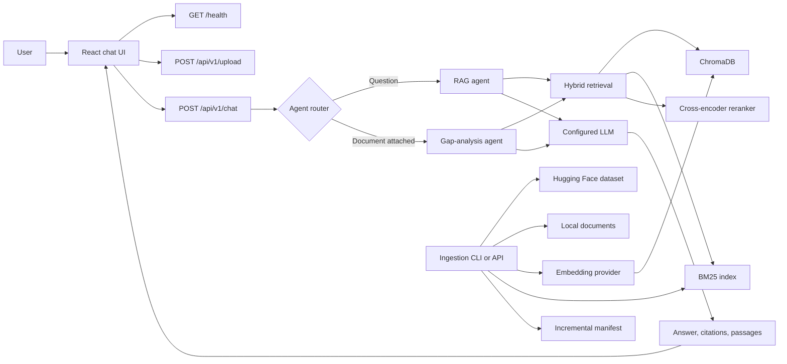

# ActLens technical documentation

This document describes the current ActLens implementation, its runtime behavior, architecture, data flow, extension points, and known limitations.

For installation and everyday usage, see the root [README](../README.md).

## 1. Product scope

ActLens is a local EU AI Act compliance assistant built around Regulation (EU) 2024/1689.

It exposes two user workflows through one chat interface:

1. **Regulation Q&A** retrieves relevant EU AI Act passages and generates a citation-backed answer.
2. **Document checking** extracts text from an uploaded policy and compares it with retrieved EU AI Act provisions.

The system is intended for compliance research and early policy review. It is not a legal decision engine and does not replace professional legal advice.

## 2. Current implementation status

Implemented:

- React and TypeScript single-page chat interface
- FastAPI backend with OpenAPI schemas
- Hugging Face and local-file ingestion
- ChromaDB semantic retrieval
- BM25 keyword retrieval
- Reciprocal Rank Fusion
- Article-number query boosting
- Cross-encoder re-ranking
- LangChain Q&A chain
- LangChain tool-calling gap-analysis agent
- Fallback gap-analysis chain for providers without tool calling
- Citations and retrieved-passage metadata
- English, French, and Dutch request schemas
- Incremental index updates
- Pluggable LLM and embedding providers
- Docker definitions for local development

Not implemented:

- Authentication or authorization
- User accounts or workspaces
- Persistent conversations
- Streaming responses
- Request rate limiting
- Background job processing
- Audit logs and operational metrics
- Retrieval and answer-quality evaluation suite
- Full API integration and browser test coverage
- Multi-tenant data isolation
- Production deployment configuration

The project is usable as a local development app. It should not be exposed directly to the public internet in its current form.

## 3. System architecture



### Runtime components

**Frontend**

The Vite application is served on port `5173` during development. It calls relative `/health` and `/api` paths, which Vite proxies to `http://localhost:8000`.

Primary responsibilities:

- Check backend and index readiness
- Collect questions and recent chat history
- Upload documents for text extraction
- Select `ask` or `gap` mode automatically
- Render Markdown answers
- Display citations and retrieved passages
- Manage conversation state in browser memory

**Backend**

The FastAPI application runs on port `8000`.

Application startup:

1. Resolve settings from the root `.env`.
2. Create the configured embedding and LLM providers.
3. Load ChromaDB and BM25 indexes.
4. Construct the RAG pipeline.
5. Construct the RAG and gap-analysis agents.
6. Store runtime services in `app.state`.

**Storage**

Generated state is kept under `storage/`:

- `storage/chroma/`: persisted vector index
- `storage/bm25/`: persisted keyword index
- `storage/manifest.json`: chunk hashes and ingestion metadata
- `storage/hf_cache/`: downloaded dataset cache

These paths are excluded from Git.

## 4. Frontend design

Entry point: `frontend/src/App.tsx`

### Application state

The root component owns:

- Selected language
- Current input
- In-memory message list
- Loading and error state
- Backend and index readiness
- Attached document name and extracted text
- Selected citation
- Retrieved passages

No state is persisted to local storage or a backend database. A page refresh clears the conversation.

### Request routing

The frontend selects the backend mode from attachment state:

```text
document attached -> mode "gap"
no document       -> mode "ask"
```

Although the backend schema still accepts additional modes such as `classify`, `find`, `compare`, and `explain`, the current interface intentionally exposes only question answering and document checking.

### Conversation history

Before each request, the frontend sends up to the latest eight messages. The backend converts those messages into LangChain message objects and includes them in the Q&A prompt.

The document gap-analysis agent does not currently include previous chat history in its prompt.

### Evidence inspector

Each successful response can contain:

- Human-readable citation labels
- Excerpts
- Source file names
- Official source URLs
- Retrieval scores
- Up to 800 characters of each retrieved chunk

The frontend uses this data to populate its evidence panel.

### Document upload

Accepted extensions:

- `.pdf`
- `.html`
- `.htm`
- `.txt`
- `.md`

The browser sends the file to `POST /api/v1/upload`. The backend:

1. Checks the extension.
2. Reads the full uploaded body.
3. Writes it to a temporary file.
4. Extracts text using the document loader.
5. Deletes the temporary file.
6. Truncates extracted text to `MAX_UPLOAD_CHARS`.
7. Returns the extracted text to the browser.

The browser later includes that text in the chat request. The configured LLM therefore receives the extracted policy content during gap analysis.

## 5. Agent architecture

### Agent router

Module: `backend/app/agents/orchestrator.py`

Routing is intentionally small:

```text
mode == "gap" or document_text exists -> GapAnalysisAgent
otherwise                             -> RAGAgent
```

### RAG agent

Modules:

- `backend/app/agents/rag_agent.py`
- `backend/app/agents/langchain/rag_runner.py`

Execution:

1. Retrieve and re-rank passages for the user query.
2. Deduplicate and fit passages into the configured context budget.
3. Build a language-aware LangChain prompt.
4. Insert recent conversation history.
5. Call the configured chat model.
6. Extract citations from selected chunks.
7. Return the answer, citations, retrieved chunks, and agent name.

The prompt requires the model to answer only from supplied context, use the chosen language, cite provided labels, and state when context is insufficient.

### Gap-analysis agent

Modules:

- `backend/app/agents/gap_agent.py`
- `backend/app/agents/langchain/gap_runner.py`

The agent checks an uploaded internal document against several legal topics:

- User-selected review focus
- Risk management
- Human oversight
- Transparency and documentation
- Data governance and quality
- Conformity assessment

For Gemini, OpenAI, and Anthropic, the runner creates a LangChain tool-calling agent with a `search_eu_ai_act` tool.

For a provider without declared tool-calling support, such as Ollama in the current configuration, it:

1. Retrieves two top passages for each topic.
2. Deduplicates the merged results.
3. Prepares a fixed legal context.
4. Runs a normal prompt chain.

The requested output includes:

1. Executive summary
2. Covered areas
3. Gaps and missing obligations
4. Recommended next actions
5. Items needing legal review

This is a qualitative LLM comparison, not a deterministic legal-control checklist.

## 6. Retrieval pipeline

Module: `backend/app/pipeline/rag.py`

### Query embedding

The configured embedding provider converts the query into a vector with `input_type="query"`.

The recommended default is the local Hugging Face model:

```text
intfloat/multilingual-e5-small
```

Document chunks are embedded separately during ingestion.

### Hybrid candidate retrieval

Module: `backend/app/retrieval/hybrid.py`

Two indexes are queried:

- ChromaDB for semantic similarity
- BM25 for lexical and exact-term matches

Both retrieval paths are filtered by the selected language when language metadata is available.

### Reciprocal Rank Fusion

The vector and keyword rankings are combined with Reciprocal Rank Fusion:

```text
score(chunk) = sum(1 / (k + rank + 1))
```

The implementation uses `k = 60`.

### Article boost

Queries matching `article <number>` receive an additional metadata-based boost. Results whose article label or `structure_path` starts with that article are multiplied by two and sorted again.

This supports direct questions such as `What does Article 9 require?`.

### Cross-encoder re-ranking

The fused candidates are scored again by:

```text
cross-encoder/ms-marco-MiniLM-L-6-v2
```

The number of retained passages is controlled by `RERANK_TOP_N`.

### Context preparation

Module: `backend/app/processing/context.py`

Before generation, chunks are:

1. Deduplicated by content hash.
2. Deduplicated by legal `structure_path`.
3. Deduplicated by their first 200 characters.
4. Sorted by legal structure.
5. Added until the token budget is reached.

The default context budget is approximately 3,000 tokens.

## 7. Ingestion

### Hugging Face dataset

Default dataset:

[jeroenherczeg/eu-ai-act](https://huggingface.co/datasets/jeroenherczeg/eu-ai-act)

The dataset provides pre-structured articles, recitals, annexes, citation labels, language metadata, source URLs, and language-independent structure paths.

Configuration:

```dotenv
DATA_SOURCE=hf
HF_DATASET_ID=jeroenherczeg/eu-ai-act
HF_DATASET_LANGUAGES=en,fr,nl
```

Run:

```powershell
python scripts\ingest.py --languages en
```

The API advertises supported request languages, but useful retrieval requires the corresponding language to be present in the index.

### Local legal sources

Supported source formats are PDF, HTML, TXT, and Markdown.

Place files under `data/raw/`, then run:

```powershell
python scripts\ingest.py --source files
```

Local documents pass through adaptive legal-structure chunking before indexing.

### Incremental behavior

Each chunk has a content hash. Re-ingestion compares current chunks with `storage/manifest.json`:

- New chunks are embedded and inserted.
- Changed chunks are re-embedded and updated.
- Unchanged chunks are skipped.

Changing the embedding model requires rebuilding compatible vector data. Existing vectors from a different embedding model must not be mixed with new vectors.

## 8. Provider system

Factory module: `backend/app/core/providers/registry.py`

### LLM providers

Supported identifiers:

- `gemini` or `google`
- `openai`
- `anthropic`
- `ollama`

LangChain chat models are created separately in `backend/app/agents/langchain/llm.py`.

Default local project configuration:

```dotenv
LLM_PROVIDER=gemini
GEMINI_MODEL=gemini-3.6-flash
```

### Embedding providers

Supported identifiers:

- `hf` or `huggingface`
- `gemini` or `google`
- `openai`
- `ollama`

Recommended configuration:

```dotenv
EMBEDDING_PROVIDER=hf
HF_EMBEDDING_MODEL=intfloat/multilingual-e5-small
```

This keeps indexing and query embeddings local while using a hosted model only for answer generation.

### Configuration lifecycle

Settings are loaded when Python imports `app.config`. Changing `.env` requires a backend process restart. A stale Uvicorn process may continue using old credentials or model names.

## 9. API reference

Base URL: `http://localhost:8000`

Interactive OpenAPI documentation: http://localhost:8000/docs

### `GET /health`

Returns:

- Service status
- Application name
- Selected LLM provider
- Selected embedding provider
- Index readiness
- Indexed chunk count
- Supported request languages
- Agent names

The endpoint confirms process and index state. It does not call the configured LLM, so a successful health response does not prove that provider credentials or model access work.

### `POST /api/v1/chat`

Request fields:

- `query`: required, 1 to 2,000 characters
- `language`: `en`, `fr`, or `nl`
- `mode`: defaults to `ask`
- `history`: up to eight user or assistant messages
- `document_text`: optional, up to 12,000 characters
- `document_name`: optional, up to 255 characters

Example:

```json
{
  "query": "What does Article 9 require?",
  "language": "en",
  "mode": "ask",
  "history": []
}
```

Response:

```json
{
  "answer": "Article 9 requires...",
  "language": "en",
  "citations": [
    {
      "label": "Art. 9 AI Act",
      "excerpt": "A risk management system shall be established...",
      "source_file": "hf:jeroenherczeg/eu-ai-act",
      "source_url": "https://eur-lex.europa.eu/...",
      "score": null
    }
  ],
  "retrieved_chunks": [],
  "agent": "rag"
}
```

Relevant errors:

- `400`: gap mode without document text
- `401`: Gemini key rejected
- `422`: request validation failure
- `429`: Gemini rate limit reached
- `502`: configured Gemini model unavailable
- `503`: index not ready

Provider-specific exceptions outside the handled Gemini errors may still surface as generic server failures.

### `POST /api/v1/upload`

Accepts a multipart form field named `file` and returns:

```json
{
  "filename": "policy.pdf",
  "char_count": 12000,
  "text": "Extracted and possibly truncated text..."
}
```

### `POST /api/v1/ingest`

Runs ingestion synchronously inside the API process.

Optional query:

```text
source=hf
source=files
source=both
```

This endpoint is unauthenticated and potentially expensive. It is suitable only for trusted local use.

### `GET /api/v1/documents`

Returns indexed sources, per-source chunk counts, last-indexed metadata, and the current total chunk count.

## 10. Configuration reference

Settings module: `backend/app/config.py`

### Application

```dotenv
APP_NAME=ActLens
DEBUG=false
CORS_ORIGINS=http://localhost:3000,http://localhost:5173
```

### Retrieval

```dotenv
RETRIEVAL_TOP_K=20
RERANK_TOP_N=5
MAX_CONTEXT_TOKENS=3000
CHUNK_SIZE=512
CHUNK_OVERLAP=64
MAX_UPLOAD_CHARS=12000
```

### Storage

```dotenv
CHROMA_PERSIST_DIR=./storage/chroma
BM25_INDEX_PATH=./storage/bm25/index.pkl
MANIFEST_PATH=./storage/manifest.json
HF_DATASET_CACHE_DIR=./storage/hf_cache
```

Relative paths are resolved from the project root calculated by the backend settings module.

## 11. Testing and verification

### Backend unit tests

```powershell
cd backend
.\.venv\Scripts\python -m pytest
```

The current suite covers:

- Legal chunking
- Gemini provider registration
- Hugging Face embedding registration
- LangChain history conversion

It does not yet cover live provider calls, hybrid retrieval quality, complete chat requests, uploads, ingestion, or gap-analysis output.

### Frontend build

```powershell
cd frontend
npm run build
```

This runs TypeScript project compilation followed by a production Vite build.

There is currently no frontend unit or browser test suite.

### Manual smoke test

1. Run ingestion.
2. Start the backend.
3. Open `/health` and confirm `index_ready`.
4. Start the frontend.
5. Ask a direct article question.
6. Open a citation and verify its excerpt.
7. Upload a synthetic TXT policy.
8. Request a gap analysis.
9. Verify the response identifies the expected agent.
10. Repeat in every indexed language.

## 12. Security and privacy model

Current behavior:

- `.env` is excluded from Git.
- Provider keys stay in the backend.
- Uploaded files are deleted after extraction.
- Extracted text remains in browser memory for the active page.
- Extracted text is sent to the selected LLM during document checking.
- Index and manifest files are local.

Current risks:

- No endpoint authentication
- No role-based access
- No per-user isolation
- No upload byte-size limit before reading into memory
- Extension-based upload validation only
- No rate limiting
- Public ingest endpoint
- Provider exception details may be returned to clients
- No security headers or production reverse-proxy policy
- No retention or consent controls

Do not process confidential documents until deployment, provider, and data-retention policies have been reviewed.

## 13. Performance characteristics

Expected startup and first-request costs:

- Loading Chroma and BM25 indexes
- Downloading the embedding model on first setup
- Loading the local embedding model
- Loading the cross-encoder on first retrieval
- Calling the hosted LLM

The first request may take substantially longer than later requests.

Current processing is synchronous from the user's perspective. Ingestion, document parsing, retrieval, re-ranking, and generation are not delegated to a job queue.

## 14. Docker notes

The repository includes backend and frontend Dockerfiles plus `docker-compose.yml`.

The frontend production image uses Nginx and proxies `/api/` and `/health` to the Compose backend service.

The local Python and Vite workflow is the currently verified development path. Before treating Docker as a supported deployment:

1. Verify that configured storage paths match mounted container paths.
2. Ensure the index is built inside, or mounted into, the location resolved by backend settings.
3. Remove Uvicorn `--reload`.
4. Pin dependency versions.
5. Add health checks and restart policies.
6. Protect chat, upload, and ingest endpoints.

## 15. Production-readiness priorities

### Priority 0: prevent unsafe exposure

- Add authentication and authorization.
- Restrict or remove the public ingest endpoint.
- Add request and upload byte-size limits.
- Add rate limiting and provider-cost controls.
- Define document privacy and retention behavior.

### Priority 1: prove correctness

- Add an authoritative retrieval evaluation set.
- Measure article retrieval recall and citation precision.
- Add API integration tests for both agents.
- Add browser tests for question and document workflows.
- Test every configured provider or narrow the supported set.

### Priority 2: improve reliability

- Standardize provider error handling.
- Add structured logs, request IDs, timing, and metrics.
- Move expensive ingestion to a background job.
- Add timeouts and cancellation.
- Pin production dependencies.
- Fix and verify Docker volume paths.

### Priority 3: product capabilities

- Persist conversations.
- Add streaming responses.
- Add an explicit structured gap-analysis schema.
- Add exportable compliance reports.
- Add document-level access controls and audit history.

## 16. Design constraints

The current design deliberately favors a small local app:

- One backend process
- Local vector and keyword indexes
- Browser-memory conversation state
- No database
- No queue
- No account system

This is appropriate for local evaluation. A multi-user deployment requires explicit storage, identity, isolation, and concurrency designs rather than incremental exposure of the local process.

## 17. References

- [Regulation (EU) 2024/1689 on EUR-Lex](https://eur-lex.europa.eu/legal-content/EN/TXT/?uri=CELEX:32024R1689)
- [EU AI Act dataset](https://huggingface.co/datasets/jeroenherczeg/eu-ai-act)
- [FastAPI documentation](https://fastapi.tiangolo.com/)
- [LangChain documentation](https://python.langchain.com/)
- [Chroma documentation](https://docs.trychroma.com/)
- [Google Gemini API documentation](https://ai.google.dev/gemini-api/docs)

## 18. License

The repository does not currently contain a license file. Add one before distributing the project as open-source software.
